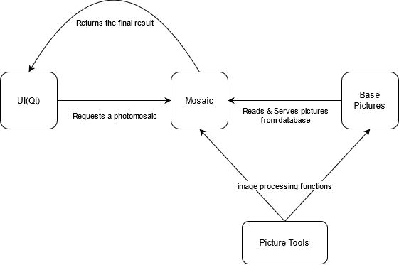
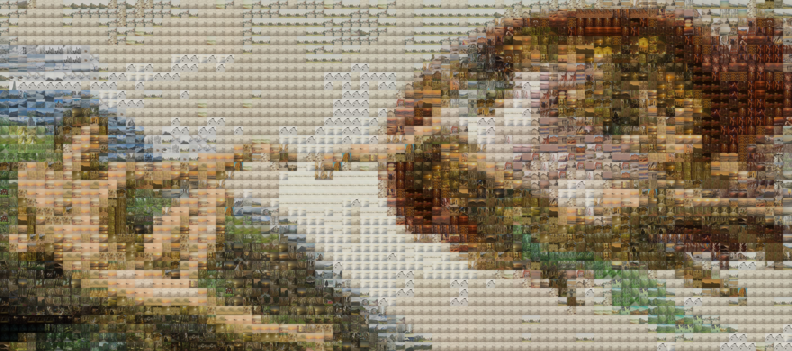
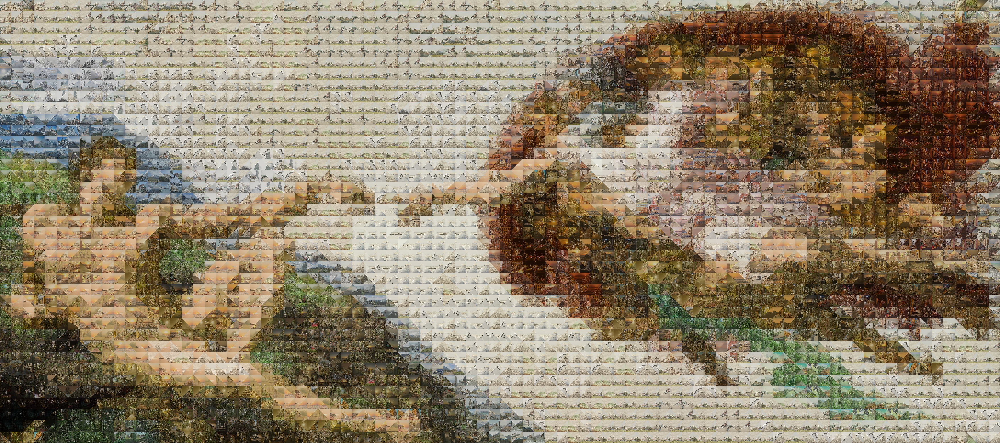

<link rel="stylesheet" type="text/css" media="all" href="Style/style.css" />

# **Mosaic++** 

## **What's Mosaic++?**
---
_**Mosaic++**_ is a tool that produces [photomosaics](https://en.wikipedia.org/wiki/Photographic_mosaic). It offers a range of options that have an effect on the final result. It can be used for entertainment purposes or be converted to an applicable tool in fields like image processing or mesh generation.

### Motivation

This project started as a college assignment for a Modern C++ course we took during the first term in our second year. We chose it because we are keen on challenging ourselves and the idea of learning image processing basics besides the required modern C++ elements was catching.

## **Features**
---
### **Photomosaic types**
Mosaics can be grouped by:

*   Shape
    *   Square shaped cells
        *   Square-mosaic
        *   Quad-mosaic
    *   Triangle shaped cells
    *   Diamond shaped cells
*   Blend
    *   with
    *   without
*   Color distance method
    *   Riemersma
    *   Euclidean

### **Other options**
The user also has some configurable parameters:
*   Select the picture to be mosaiced
*   Cell size
*   Add/Replace to the database of cell-pictures
*   Final result options
    *   Final result extension
        *   *.jpg
        *   *.png
    *   Final result resolution
        *   keep original
        *   custom width and/or height
    *   Final result name
    *   Final result save location
*   Quad-Mosaic options
    *   Threshold
    *   Minimum cell size
    *   with/without details

## **Flow**
---


## **How it works**
---
### ```BasePictures.h```

   ```c++
    class BasePictures
    {
        public:
        /*
            This class handles most of the directory work using <filesystem>.
            It maps every image and its path with a key equal to its mean.
            In this case, it is fairly efficient (in terms of time complexity) 
            to have acces to any image that is needed.
        */
    };
   ```

### ```Mosaic.h```

```c++
class Mosaic
{
    public:
    /*
        This class handles all the mosaicing algorithms and logic. It recieves
        an input image and the user's desired configurations and passes the
        cv::Mat object through all the required methods in order to process the
        final photomosaic.  
    */
};
```

### ```PictureTools.dll```

```c++
class PictureTools
{
    public:
    /*
        This class has multiple image processing methods. It is used to resize,
        crop, blend and calculate the mean for a given photo.
    */
};
```

### ```QuadTreeImages.h```

```c++
class QuadTreeImages
{
    public:
    /*
        This class is used inside the Mosaic class in order to quad-divide a
        photo. It represents a QuadTree data structure implemented by us for
        the purpose of this project.
    */
};
```

### ```StopWatch.h```

```c++
class StopWatch
{
    public:
    /*
        This class's purpose is to count the time our mosaicing algorithms take
        to finish in seconds. We used it to benchmark and test our code.
    */
};
```

### ```mainwindow.h``` | ```QuadWindow.h``` | ```Settings.h```

```c++
class MyWindow : public QMainWindow
{
    public:
    /*
        These classes are UI classes that connect the user to the back-end
        processes. Our UI also acts like a config manager, letting the user
        choose from a range of options(shape, final size, algorithm used, etc)
        in order to make the tool more flexible. 
    */
};
```

## **Tech used:**
---
### Libraries and Frameworks:
*   Qt
*   OpenCV

### Modern elements used:
*   Threading
    *   Every Mosaic type runs on 4 *threads*, greatly increasing performance.
*   Modern *structures*, *algorithms* and *synthax*
    *   Everything from *maps* to *smart-pointers* ensures our code is both readable and memory-leak proof
*   UnitTests
    *   *Test-Driven-Development* helped us spot out bugs

## Examples
---
### Quad-Mosaic
#### The threshold option have a great inpact in the final result, especially when things got a little bit bigger (or in our case, tremendously large :smile:). 
<table>
  <tr>
    <td>Input Image (10,000 x 10,000)</td>
     <td>Resulted Mosaic (threshold = 50)</td>
     <td>Resulted Mosaic (threshold = 1000)</td>
  </tr>
  <tr>
    <td></td>
    <td></td>
    <td></td>
  </tr>
 </table>

### Square-Mosaic
 <table>
  <tr>
    <td>Input Image</td>
     <td>Square shaped cells</td>
     <td>Diamond shaped cells</td>
     <td>Diamond shaped cells</td>
  </tr>
  <tr>
    <td></td>
    <td></td>
    <td></td>
    <td></td>
  </tr>
 </table>

___
## Authors:

[Ionuț-Alin Dinu](https://github.com/Dinu-Alin) | 
[Adrian Călăvie](https://github.com/adriancalavie) |
[Florin Arhip](https://github.com/Florin9925)
